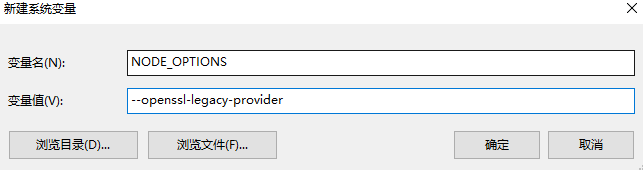

# FAQ

## `error:0308010C:digital envelope routines::unsupported`

> 参考链接：
> 
> <https://github.com/ant-design/ant-design-pro/issues/9272>

在 Node 17 版本的情况下启动会报错，有两种解决方案。

**方案一**

将 Node 的版本降低回 16 及以下

**方案二**

通过设置环境变量 `NODE_OPTIONS=--openssl-legacy-provider`，以下根据自己的情况任选一种即可：

*Linux*

```shell
export NODE_OPTIONS=--openssl-legacy-provider
```

*Windows*



*IDEA*

